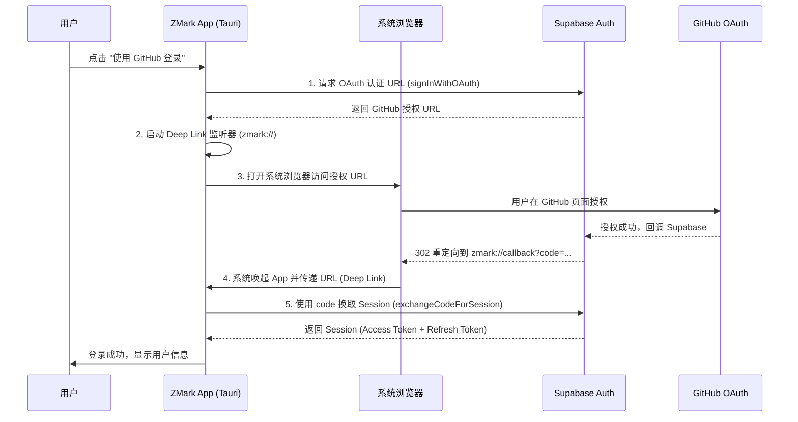

# zmark

zmark 是一个基于 Tauri 2 + React 19 构建的现代化 Markdown 编辑器与本地知识库（RAG）助手。它结合了极致的编辑体验与智能化的文档问答能力。

## ✨ 特性

- **📝 现代化编辑器**:
  - 基于 Tiptap 构建，支持所见即所得的 Markdown 编辑体验。
  - 支持代码高亮（lowlight）、图片上传、高亮标注、链接管理等。
  - 内置快捷键支持（如 `Cmd/Ctrl + S` 保存）。
- **🧠 智能知识库 (RAG)**:
  - 支持导入本地 Markdown 文档构建专属知识库。
  - 集成 SiliconFlow API，使用 `BAAI/bge-m3` 进行向量嵌入，`Qwen/Qwen2.5-7B-Instruct` 进行流式问答。
  - 支持检索过程可视化，展示参考文档及其相似度。
- **🎨 极致体验**:
  - 使用 Tailwind CSS 4 构建的响应式 UI。
  - 原生支持深色模式。
  - 基于 SQLite 的本地数据存储，保护隐私。
  - 高性能的 Rust 后端处理向量计算与文件 IO。

## 🛠️ 技术栈

- **前端**: React 19, Vite, Tailwind CSS 4, Tiptap, Zustand, Shadcn UI.
- **后端**: Tauri 2, Rust, SQLite (rusqlite).
- **AI 能力**: SiliconFlow API (BGE-M3 + Qwen2.5).

## 安装

### 前置要求

确保你的机器上已安装：
- [Rust](https://www.rust-lang.org/tools/install) (用于构建后端)
- [Node.js](https://nodejs.org/) (建议 v18+, 用于构建前端)
- [pnpm](https://pnpm.io/installation) (包管理器)

### 安装依赖

1. 克隆仓库：
   ```bash
   git clone https://github.com/zhoumowan/zmark.git
   cd zmark
   ```

2. 安装前端依赖：
   ```bash
   pnpm install
   ```

## 使用

### 开发模式

启动开发服务器（包含前端热更新和 Tauri 窗口）：

```bash
pnpm dev
```

### 构建应用

构建生产环境的应用程序（macOS/Windows/Linux）：

```bash
pnpm build
```

构建产物将位于 `src-tauri/target/release/bundle` 目录下。

### 配置

1. **AI 问答**: 在应用内点击“设置”图标，配置你的 SiliconFlow API Key。
2. **GitHub OAuth**: 应用内置了 Supabase Auth 配置，无需额外设置即可使用 GitHub 登录。

## 🔐 认证流程

本项目使用 Supabase Auth 进行用户认证，集成了 GitHub OAuth 登录。由于是桌面应用，我们采用了 Deep Link (自定义协议 `zmark://`) 来处理回调。

### 流程图



### 关键步骤解析

1.  **获取认证 URL**: App 调用 Supabase SDK 获取 GitHub 的 OAuth 授权链接，参数中指定 `redirectTo: "zmark://callback"`。
2.  **设置监听**: 在打开浏览器前，App 会启动对 `zmark://` 协议的监听（支持冷启动和热启动两种情况）。
3.  **浏览器授权**: 为了安全和体验，授权过程在系统默认浏览器中进行，而不是 App 内嵌的 WebView。
4.  **Deep Link 回调**: GitHub 授权完成后回调 Supabase，Supabase 再重定向到 `zmark://` 协议的 URL。操作系统识别该协议并唤起 ZMark App。
5.  **Code 交换 Session**: App 截获 URL 中的 `code` 参数，调用 Supabase SDK 换取最终的 Session，完成登录。

## License